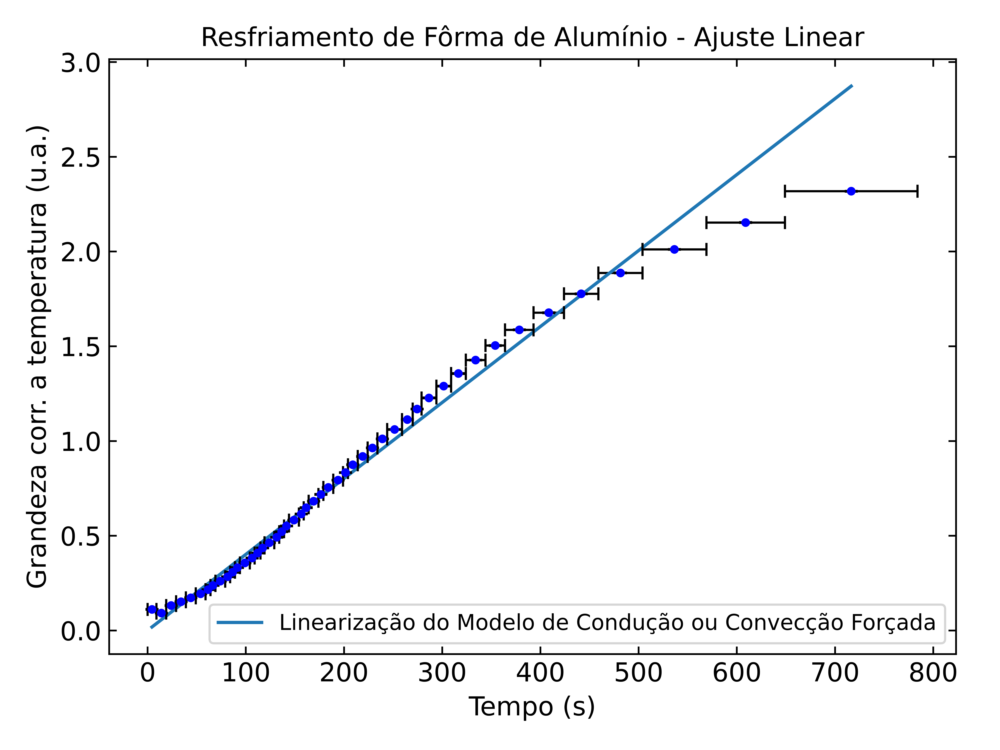

# Documento Auxiliar ao Relatório 5

## Calorímetro Fechado 

### Modelo 1 - Condução e Convecção Forçada

Chi Square Test: 0.9320180381815618
Quadrado da Diferença da Previsão e do Modelo: 1.104620973491319

### Modelo 2 - Convecção Natural

Chi Square Test: 0.06158282984642778
Quadrado da Diferença da Previsão e do Modelo: 1.4792902265898322

### Veredito

O melhor Modelo foi o 2, pelo Teste de Associação ( ou "do Chi-Quadrado")

### Gráficos

| Ajuste não-linear | Ajuste linear |
| ----------------- | ------------- |
|  |  |

## Fôrma de Alumínio 

### Modelo 1 - Condução e Convecção Forçada

Chi Square Test: 86.57062088818616
Quadrado da Diferença da Previsão e do Modelo: 4.514882711049803

### Modelo 2 - Convecção Natural

Chi Square Test: 101.91387982003492
Quadrado da Diferença da Previsão e do Modelo: 9.081764083837381

### Veredito

O melhor Modelo foi o 1, pelo Teste de Associação (ou "do Chi-Quadrado")e pelo Teste do Último Valor

### Gráficos

| Ajuste não-linear | Ajuste linear |
| ----------------- | ------------- |
|  |  |

## Garrafa Térmica Aberta 

### Modelo 1 - Condução e Convecção Forçada

Chi Square Test: 49.08753134540137
Quadrado da Diferença da Previsão e do Modelo: 4.113863164063553

### Modelo 2 - Convecção Natural

Chi Square Test: 0.01039551270531944
Quadrado da Diferença da Previsão e do Modelo: 0.8010354166542702

### Veredito

O melhor Modelo foi o 2, pelo Teste de Associação ( ou "do Chi-Quadrado") e pelo Teste do Último Valor

### Gráficos

| Ajuste não-linear | Ajuste linear |
| ----------------- | ------------- |
|  |  |

## Garrafa Térmica Fechada 

### Modelo 1 - Condução e Convecção Forçada

Chi Square Test: 0.18555567520645583
Quadrado da Diferença da Previsão e do Modelo: 1.757390499390526

### Modelo 2 - Convecção Natural

Chi Square Test: 0.020301720617134464
Quadrado da Diferença da Previsão e do Modelo: 1.6447873872157857

### Veredito

O melhor Modelo foi o 2, pelo Teste de Associação ( ou "do Chi-Quadrado") e pelo Teste do Último Valor

### Gráficos

| Ajuste não-linear | Ajuste linear |
| ----------------- | ------------- |
|  |  |

## Termômetro 

### Modelo 1 - Condução e Convecção Forçada

Chi Square Test: 63.26408964280485
Quadrado da Diferença da Previsão e do Modelo: 9.068402306878975

### Modelo 2 - Convecção Natural

Chi Square Test: 31.87183566514953
Quadrado da Diferença da Previsão e do Modelo: 5.062371803415205

### Veredito

O melhor Modelo foi o 2, pelo Teste de Associação ( ou "do Chi-Quadrado") e pelo Teste do Último Valor

### Gráficos

| Ajuste não-linear | Ajuste linear |
| ----------------- | ------------- |
|  |  |

## Calorímetro Aberto 

### Modelo 1 - Condução e Convecção Forçada

Chi Square Test: 8.711757469786184
Quadrado da Diferença da Previsão e do Modelo: 3.557632153932195

### Modelo 2 - Convecção Natural

Chi Square Test: 1.612758601496624
Quadrado da Diferença da Previsão e do Modelo: 5.243964665149307

### Veredito

O melhor Modelo foi o 2, pelo Teste de Associação ( ou "do Chi-Quadrado")

### Gráficos

| Ajuste não-linear | Ajuste linear |
| ----------------- | ------------- |
|  |  |
